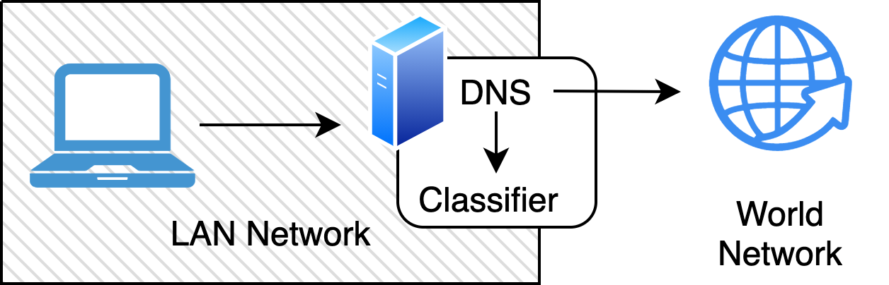

# W2S-WEBCLAS(S)IFIER
This project contains the code of the web sites classifier. The classifier can classify pages into few categories (see examples below). This is my study project and this will be not supported anymore.

## How it works


## Prerequisites
1. [nslookup](https://en.wikipedia.org/wiki/Nslookup)
2. [docker-compose](https://docs.docker.com/compose/)
## Running

1. Run services:
```bash
make run
```

2. Test them in other terminal:
```bash
[･‿･]  W2S-WebClasifier master ✗ nslookup "www.github.com" localhost
Server:         localhost
Address:        127.0.0.1#53

Non-authoritative answer:
Name:   www.github.com
Address: 140.82.121.3

[･‿･]  W2S-WebClasifier master ✗ nslookup "www.redtube.com" localhost
Server:         localhost
Address:        ::1#53

Non-authoritative answer:
Name:   www.redtube.com
Address: 66.254.114.238   <- this is the IP address of the Oracle website
```

3. Note that for the redtube request, the server returned the IP address of the Oracle website (bad boy!)

## Test classifier

``` bash
[･‿･]  W2S-WebClasifier master ✗ curl "localhost:5050/?siteUrl=https://www.nytimes.com/"
{
    "Politics": 23.3,
    "Nature": 17.04,
    "IT": 15.69,
    "Technology": 12.28,
    "Entertainment": 10.1,
    "Health": 8.18,
    "Science": 5.96,
    "Porn": 4.71,
    "Cooking": 2.74
}
[･‿･]  W2S-WebClasifier master ✗ curl "localhost:5050/?siteUrl=www.github.com"
{
    "IT": 60.15,
    "Technology": 9.59,
    "Nature": 7.09,
    "Politics": 6.23,
    "Health": 4.26,
    "Entertainment": 4.22,
    "Science": 3.55,
    "Porn": 3.06,
    "Cooking": 1.85
}
[･‿･]  W2S-WebClasifier master ✗ curl "localhost:5050/?siteUrl=www.redtube.com"
{
    "Porn": 63.39,
    "IT": 9.93,
    "Nature": 6.84,
    "Entertainment": 5.62,
    "Technology": 5.44,
    "Politics": 2.6,
    "Health": 2.12,
    "Science": 2.07,
    "Cooking": 1.99
}
```